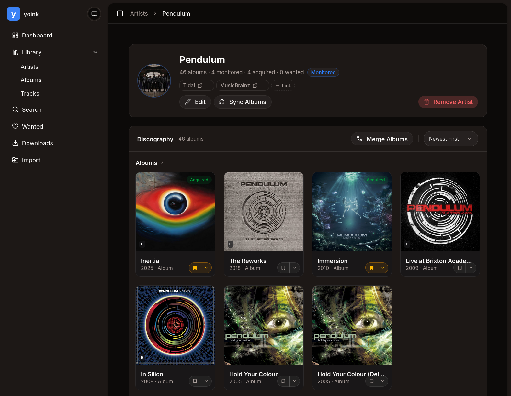

<h1 align="center">
   
  yoink
</h1>

yoink is a self-hosted music library manager that lets you search, download, tag, and organize your collection from multiple sources all from a single, clean web interface

> [!WARNING]
> yoink is under active development and is **not production ready**. Expect breaking changes, incomplete features, and rough edges. **Do not point yoink at your main music library** — use a separate copy or a fresh directory until the project stabilizes.

This project is built using AI tools like OpenCode and Codex. All code is reviewed and tested by me, but if you encounter any weirdness and don't hesitate to report any issues you find.

## What Is Yoink?

I ran my Lidarr instance for years, but it was really, thightly coupled to its metadata source. (MusicBrainz if I remember correctly?)
Some of the stuff I like to listen to is not well represented there, as well as new stuff that artists just drop without any announcement.
I also had issues finding good quality downloads for some of the less mainstream music on larger indexers.

yoink was created to solve these issues by leveraging a multi-provider architecture, where you can pull in metadata from multiple sources (currently Tidal, Deezer and MB are supported) and download them via hifi-api and SoulSeek.
This way (just like in IT security) you can use multiple metadata sources to cover each other's gaps.

## Key Features

- **Unified multi-provider search**: you search artists/albums/songs across all providers at once
- **Hi-res downloads**: You can download the highest quality stuff directly from hifi instances. No need for indexers and external DL clients
- **Artist profiles**: Unified artist pages combine a single artist from all of your providers (you still have to manually add them)
- **Lightweight & fast** — Built with Rust for minimal resource usage; runs happily on a Raspberry Pi or a [BEEFY COMPUTER](https://www.youtube.com/watch?v=ZMGEO4URQqQ)

Other features and their status can be found in the [roadmap](ROADMAP.md).

### Supported Providers

| Provider        | Type                 | Notes                                                        |
| --------------- | -------------------- | ------------------------------------------------------------ |
| **Tidal**       | Streaming / Download | Uses a [hifi-api](https://github.com/binimum/hifi-api) proxy |
| **Deezer**      | Metadata             | Metadata only                                                |
| **MusicBrainz** | Metadata             | Open music database for enrichment                           |
| **SoulSeek**    | P2P / Download       | Via [slskd](https://github.com/slskd/slskd)                  |

## Usage

You can learn how to set up yoink for yourself in the documentation at <https://yoink-docs.vercel.app>.

## Built With

yoink is built with **Rust and React**, [Axum](https://github.com/tokio-rs/axum) for the server and [SQLite](https://www.sqlite.org/) via [SQLx](https://github.com/launchbadge/sqlx) for storage.
The frontend is built with [Tanstack Start](https://tanstack.com/start) and [shadcn/ui](https://ui.shadcn.com/) for components.

## Contributing

Contributions are welcome! Whether it's a filing an issue, bug fix, new feature, or documentation improvement:

1. Fork the repository
2. Create a feature branch
3. Use [Conventional Commits](https://www.conventionalcommits.org/) for your commit messages
4. Keep `CHANGELOG.md` and crate versions untouched; releases are managed by `release-please`
5. Submit a pull request
